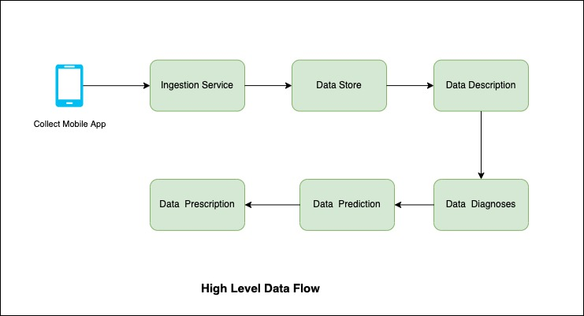

# Collect
Collect is a data collection platform that is being used by customers in 35+ countries, has over 100,000 data collectors relying on it, and has powered data collection for over 11 million responses. Its features include team management, multilingual forms, and offline data collection. Our customers use Collect to power their most critical activities — from governments delivering vaccines to small business owners managing their daily inventory, to a zoo monitoring a rare wildlife species.

## Requirements
This section contains the requirements, distilled from the [provided document](https://docs.google.com/document/d/1C_VTxm3W6l4D4CyANVb6Hu5TKlZ9Ajn2ed-7h9sw84A/edit).

- **Ingestion service and primary store** : The ingestion service interacts with a frontend that collects primary data points, which at this point is an Android app. This is the base CRUD and the starting point for a data point entering the ecosystem thus needs to be highly reliable

- **Data Analyses**: The external business need for generating insights from the collected data, This is about enabling as much as possible of the four layers of analytics within the platform -- **descriptive**, **diagnostic**, **predictive**, and **prescriptive**.

- **Integration**: Integration with 3rd Party APIs. For example, I was a client want all my data to show up on a Google sheet as they have other business workflows enabled from there.
 
 
## Challange
Creae Architectural solution for above requirments. Initially limit sope of this task to just descriptive analysis.  
Some aspects of the solution to cover (as Frank McCourt once said, “the sky is the limit,” so feel free to not be limited to these): 
- Authorization levels in the platform
- What to use for and how to store the data points [schematics] coming in?
- Do you think we need multiple stores? If yes, streams vs. batch as a general data flow paradigm - use of one across the platform vs. a mix of things?
- Is moving data around really necessary? How do we mitigate the perils of such a setup?
- Keep resource usage [memory, CPU], throughput in mind
- How does all this get deployed?
- Already existing tools you’d want to use and what to build and why?
- How do you know this design will hold and up to when? is there a way to quantify/measure the quality of your design?
- Potential caveats in your solution

## Questions/Assumption
- What is the scale of data that collected by app ?
    1 million response per day
- Data analyses real time or process after certain duration or size (batch) ?
     both
- How long should we keep the data ?
    1 year or configurable
- Data collection done by only android app ?
    currently by android app only in future integrate with web, third party apps.
- Which third party integration supported ?
    Google sheet, Power BI and others. System should easy to integrate with third party tools.
  
## NonFunctional Requirment
- Scalability: The system should be scalable to accommodate growing data responses.
- Reliability: The system should be highly reliable to avoid missing critical alerts.
- Flexibility: Technology keeps changing, so the pipeline should be flexible enough to easily integrate new technologies in the future.
 

  

## Ingestion Service:
Ingestion Service is starting data point of the system. Need to be highly reliable and scallable.

**API**
| API                  | Detail                                                                       |
| ---------------------| ---------------------------------------------------------------------------- |
| POST /v1/form/{formId}/response | submit form response to Ingestion Service                         |

API received auth token for authentication and authorization. Auth service create auth token based on user credentials. Ingestion Service verify this token by secret, and authorize request by role assign to user.  

Ingestion Service should be stateless, so it can be scale as required.  

Ingestion service need to handle large amount of response. Ingestion service API is write heavy.  
Database is not good choice as we need to stream form responses. see [Database as Queue antipattern](http://blog.codepath.com/2012/11/15/asynchronous-processing-in-web-applications-part-1-a-database-is-not-a-queue/) 

## Scale through Kafka
Kafka, or more officially known as Apache Kafka®, is a popular open source software platform for streaming data, used to store event-based messages in sequential order. The software scales horizontally across multiple servers for high-velocity, high-volume data.

Apache Kafka is used for storing streaming data, to let application developers build streaming applications that process and react to that data. It stores data in a persistent, fault-tolerant manner. It can be used as a replacement for traditional message brokers with its ability to handle large volumes of data with high speed. It can also be used for log aggregation and in stream processing data pipelines.

There are a couple of ways that we can leverage Kafka’s built-in partition mechanism to scale our system.
- Configure the number of partitions based on throughput requirements.
- Partition metrics data by metric names, so consumers can aggregate data by metrics names.

