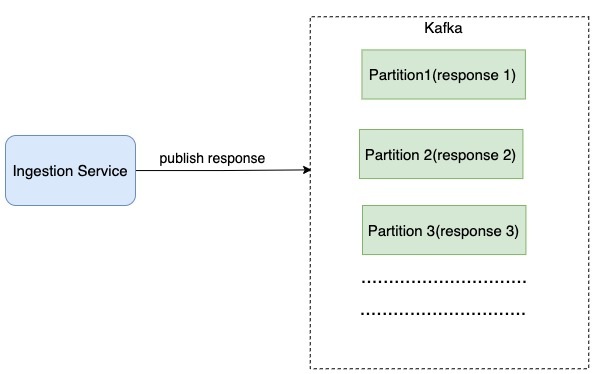

# Collect
Collect is a data collection platform that is being used by customers in 35+ countries, has over 100,000 data collectors relying on it, and has powered data collection for over 11 million responses. Its features include team management, multilingual forms, and offline data collection. Our customers use Collect to power their most critical activities — from governments delivering vaccines to small business owners managing their daily inventory, to a zoo monitoring a rare wildlife species.

## Requirements
This section contains the requirements, distilled from the [provided document](https://docs.google.com/document/d/1C_VTxm3W6l4D4CyANVb6Hu5TKlZ9Ajn2ed-7h9sw84A/edit).

- **Ingestion service and primary store** : The ingestion service interacts with a frontend that collects primary data points, which at this point is an Android app. This is the base CRUD and the starting point for a data point entering the ecosystem thus needs to be highly reliable

- **Data Analyses**: The external business need for generating insights from the collected data, This is about enabling as much as possible of the four layers of analytics within the platform -- **descriptive**, **diagnostic**, **predictive**, and **prescriptive**.

- **Integration**: Integration with 3rd Party APIs. For example, I was a client want all my data to show up on a Google sheet as they have other business workflows enabled from there.
 
 
## Challange
Creae Architectural solution for above requirments. Initially limit sope of this task to just descriptive analysis. <br/>
Some aspects of the solution to cover (as Frank McCourt once said, “the sky is the limit,” so feel free to not be limited to these): 
- Authorization levels in the platform
- What to use for and how to store the data points [schematics] coming in?
- Do you think we need multiple stores? If yes, streams vs. batch as a general data flow paradigm - use of one across the platform vs. a mix of things?
- Is moving data around really necessary? How do we mitigate the perils of such a setup?
- Keep resource usage [memory, CPU], throughput in mind
- How does all this get deployed?
- Already existing tools you’d want to use and what to build and why?
- How do you know this design will hold and up to when? is there a way to quantify/measure the quality of your design?
- Potential caveats in your solution

## Questions/Assumption
- What is the scale of data that collected by app ?
  <br/> 1 million response per day
- Data analyses real time or process after certain duration or size (batch) ?
   <br/> both
- How long should we keep the data ?
  <br/> 1 year or configurable
- Data collection done by only android app ?
  <br/> currently by android app only in future integrate with web, third party apps.
- Which third party integration supported ?
  <br/> Google sheet, Power BI and others. System should easy to integrate with third party tools.
- Assumption: Form Building and validation is out of scope for this challange. There is separate form-service which is responsible for form creation and validation.  
  
## Non-functional Requirment
- Scalability: The system should be scalable to accommodate growing data responses.
- Reliability: The system should be highly reliable to avoid missing critical alerts.
- Flexibility: Technology keeps changing, so the pipeline should be flexible enough to easily integrate new technologies in the future.
<br/>
<p align="center">
  
</p>

## Ingestion Service:
Ingestion Service is starting data point of the system. Need to be highly reliable and scallable.

**API**
| API                  | Detail                                                                       |
| ---------------------| ---------------------------------------------------------------------------- |
| POST /v1/form/{formId}/response | submit form response to Ingestion Service                         |

API received auth token for authentication and authorization. Auth service create auth token based on user credentials. Ingestion Service verify this token by secret, and authorize request by role assign to user.  

Ingestion Service should be stateless, so it can be scale as required. <br/>

Ingestion service need to handle large amount of response. Ingestion service API is write heavy. <br/>
Database is not good choice as we need to stream form responses. see [Database as Queue antipattern](http://blog.codepath.com/2012/11/15/asynchronous-processing-in-web-applications-part-1-a-database-is-not-a-queue/) 

## Scale through Kafka
Kafka, or more officially known as Apache Kafka®, is a popular open source software platform for streaming data, used to store event-based messages in sequential order. The software scales horizontally across multiple servers for high-velocity, high-volume data.

Apache Kafka is used for storing streaming data, to let application developers build streaming applications that process and react to that data. It stores data in a persistent, fault-tolerant manner. It can be used as a replacement for traditional message brokers with its ability to handle large volumes of data with high speed. It can also be used for log aggregation and in stream processing data pipelines.

There are a couple of ways that we can leverage Kafka’s built-in partition mechanism to scale our system.
- Configure the number of partitions based on throughput requirements.
- Partition response by form id or another parameter, so consumers can aggregate data by form id.

<p align="center" style = "padding:10px,10px,10px,10px;">
  
</p>

## Data Pipeline
Here we need to series of data processing operation like  **descriptive**, **diagnostic**, **predictive**, and **prescriptive**. We can use data pipeline for achieve all data processiong.


Data pipelines consist of three key elements: a source, a processing step or steps, and a destination. In some data pipelines, the destination may be called a sink. Data pipelines enable the flow of data from an application to a data warehouse, from a data lake to an analytics database, or into a payment processing system, for example. Data pipelines also may have the same source and sink, such that the pipeline is purely about modifying the data set. Any time data is processed between point A and point B (or points B, C, and D), there is a data pipeline between those points.

Data pipeline can be implemented by using Batching or Streaming or both.

#### Streaming vs batching

|   |  Online System | Batch System (Offline System)  | Streaming System (near real-time)  |
|---|---|---|---|
| Responsiveness    |	Respond to the client quickly |	No response to the client needed	| No response to the client needed  |
| Input	| User requests	Bounded | input with finite size. | A large amount of data	Input has no boundary (infinite streams) |
| Output	| Responses to clients |	Materialized views, aggregated metrics, etc.	| Materialized views, aggregated metrics, etc. |
| Performance measurement	| Availability,latency | Throughput | Throughput, latency |
| Example	| Online shopping	| MapReduce |	Flink |


In our design, both stream processing and batch processing are used. We utilized stream processing to process data as it arrives and generates results in a near real-time fashion. We utilized batch processing for response that not reequire real time result and also can be used for hiisorical data backup and.

For a system that contains two processing paths (batch and streaming) simultaneously, this architecture is called [lambda-architecture](https://www.databricks.com/glossary/lambda-architecture). A disadvantage of lambda architecture is that you have two processing paths, meaning there are two codebases to maintain. [Kappa architecture](https://hazelcast.com/glossary/kappa-architecture/), which combines the batch and streaming in one processing path, solves the problem. The key idea is to handle both real-time data processing and continuous data reprocessing using a single stream processing engine. Below figure shows a comparison of lambda and kappa architecture.

<p align="center" >
  
</p>

### Data Model
There are multiple types of data in the system.
- Form Response (CRUD)
- Analytical Data 
- Dashboard and Alert Data
- Archived Data

#### Form Response
We need to maintain form responses for partical time of duration. Also need to support CRUD operation.

Sample Form Response :
```
{
  "formId": "0VHCsOl4JCjrCxwfF7G8",
  "responseTime": {
    "totalTime": 54410
  },
  "lastModifiedOnDeviceAt": "2022-09-24T13:36:57.239+0000",
  "submittedOnDeviceAt": "2022-09-24T13:36:57.239+0000",
  "createdOnDeviceAt": "2022-09-24T13:36:02.829+0000",
  "syncedFromDeviceAt": "2022-09-24T13:36:57.444+0000",
  "client": "android",
  "ip": "100.90.66.167",
  "deviceId": "collect-bot-device",
  "answers": [
    {
      "key": "Name",
      "text": "Dixie",
      "state": "active",
      "questionId": "I2KSMRQz05kFlOLwJYHe",
      "createdBy": "userId",
      "createdOnDeviceAt": "2022-09-24T13:36:03.386+0000",
      "lastModifiedOnDeviceAt": "2022-09-24T13:36:12.200+0000",
      "questionType": "Text"
    },
    {
      "key": "Gender",
      "text": "Male",
      "state": "active",
      "questionId": "DBcLUrwL3sAgz7bIRTin",
      "createdBy": "userId",
      "createdOnDeviceAt": "2022-09-24T13:36:12.670+0000",
      "lastModifiedOnDeviceAt": "2022-09-24T13:36:12.670+0000",
      "questionType": "Choice"
    },
    {
      "key": "Age",
      "text": "26",
      "state": "active",
      "number": 26,
      "questionId": "dLKQv4txPGAbkJxaoMpJ",
      "createdBy": "userId",
      "createdOnDeviceAt": "2022-09-24T13:36:15.663+0000",
      "lastModifiedOnDeviceAt": "2022-09-24T13:36:15.663+0000",
      "questionType": "Number"
    },
    {
      "key": "Hobby",
      "text": "Gardening 🥕, Reading books 📖, Playing Sports 🤾",
      "state": "active",
      "questionId": "unZDIQC2o87QMuBWrFiA",
      "createdBy": "userId",
      "createdOnDeviceAt": "2022-09-24T13:36:18.602+0000",
      "lastModifiedOnDeviceAt": "2022-09-24T13:36:18.602+0000",
      "questionType": "MultiChoice"
    },
    {
      "key": "Phone",
      "text": "ZA(+27)-605559400",
      "phone": "+27605559400",
      "state": "active",
      "questionId": "4D31fFKbiq7StQ6X9drC",
      "createdBy": "userId",
      "createdOnDeviceAt": "2022-09-24T13:36:35.427+0000",
      "lastModifiedOnDeviceAt": "2022-09-24T13:36:35.427+0000",
      "questionType": "Phone"
    },
    {
      "key": "Location",
      "state": "active",
      "questionId": "VKJYAKT6EyagCG09vpTf",
      "responseId": "8852b8a2-20de-4b3a-82c4-baca736ffe04",
      "createdBy": "userId",
      "createdOnDeviceAt": "2022-09-24T13:36:54.817+0000",
      "lastModifiedOnDeviceAt": "2022-09-24T13:36:54.817+0000",
      "questionType": "Location",
      "location": {
        "coordinates": [
          {
            "latitude": 6.5243793,
            "longitude": 3.3792057
          }
        ],
        "type": "point"
      }
    }
  ]
}
```

#### Choose the right database
When it comes to choosing the right database, we need to evaluate the following:
- What does the data look like? Is the data relational? Is it a document or a blob?
- Is the workflow read-heavy, write-heavy, or both?
- Is transaction support needed?
- Do the queries rely on many online analytical processing (OLAP) functions like SUM, COUNT?
Relational databases can do the job, but scaling the write can be challenging. NoSQL databases like MongoDB, Cassandra and InfluxDB are more suitable because they are optimized for write. 

SQL databases, also known as relational databases, were designed to store data that has a structured schema. The schema represents the design of the database to which the data should adhere to. 

MongoDB, there is no need to predefine any schema. A collection can store different types of documents without any problem. There is nothing to worry about if a new type of document arrives, it can easily be saved. The dynamic nature of MongoDB schema is useful because most of the data that is being generated as form-responses are non-structured.There are many good solutions available to support MongoDB analytics, including: data virtualization, translation, the MongoDB connector, and data warehousing with an ETL or ELT process.

For Form-response data MongoDB is good choice.

For Analytical, Dashbooard data we can use NoSQL data or analytical tool like Power BI, tableau or other.

###
