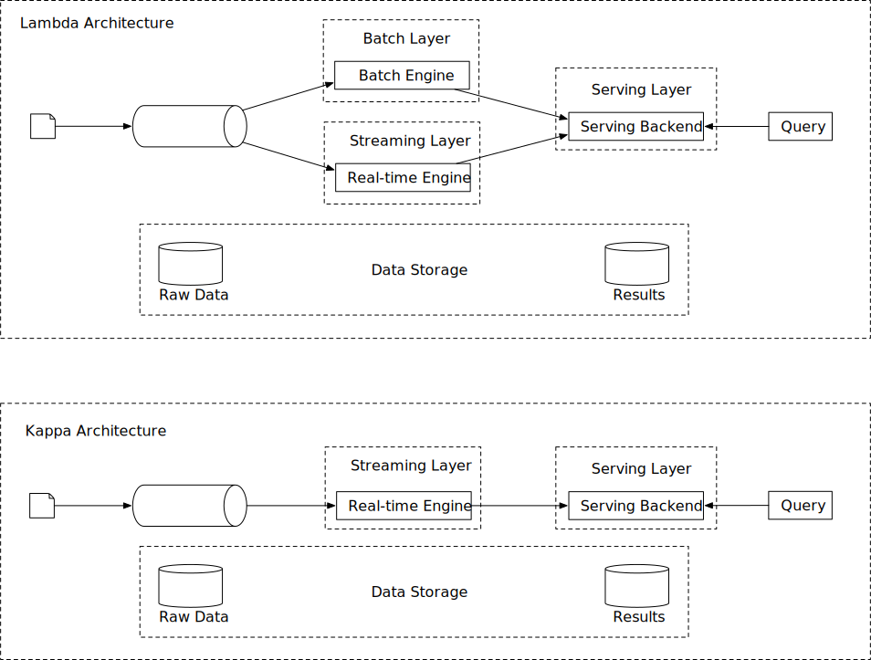
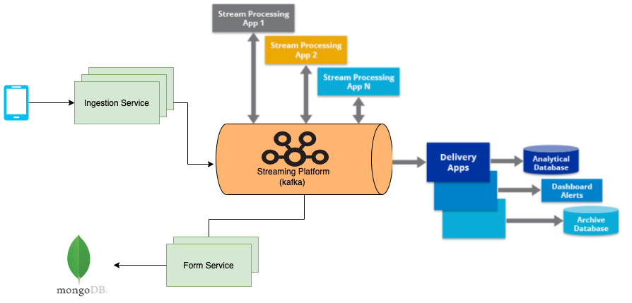
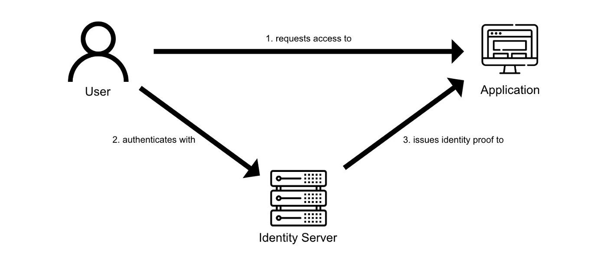
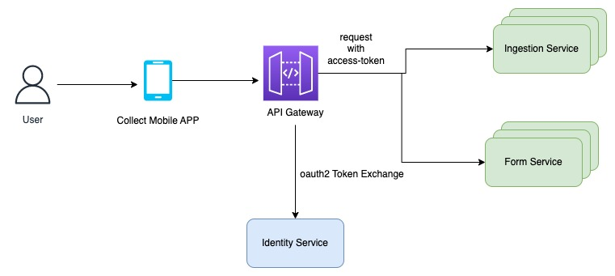

# Collect
Collect is a data collection platform that is being used by customers in 35+ countries, has over 100,000 data collectors relying on it, and has powered data collection for over 11 million responses. Its features include team management, multilingual forms, and offline data collection. Our customers use Collect to power their most critical activities — from governments delivering vaccines to small business owners managing their daily inventory, to a zoo monitoring a rare wildlife species.

## Requirements
This section contains the requirements, distilled from the [provided document](https://docs.google.com/document/d/1C_VTxm3W6l4D4CyANVb6Hu5TKlZ9Ajn2ed-7h9sw84A/edit).

- **Ingestion service and primary store** : The ingestion service interacts with a frontend that collects primary data points, which at this point is an Android app. This is the base CRUD and the starting point for a data point entering the ecosystem thus needs to be highly reliable

- **Data Analyses**: The external business need for generating insights from the collected data, This is about enabling as much as possible of the four layers of analytics within the platform -- **descriptive**, **diagnostic**, **predictive**, and **prescriptive**.

- **Integration**: Integration with 3rd Party APIs. For example, I was a client want all my data to show up on a Google sheet as they have other business workflows enabled from there.
 
 
## Challange
Create Architectural solution for above requirments. Initially limit sope of this task to just descriptive analysis. <br/>
Some aspects of the solution to cover (as Frank McCourt once said, “the sky is the limit,” so feel free to not be limited to these): 
- Authorization levels in the platform
- What to use for and how to store the data points [schematics] coming in?
- Do you think we need multiple stores? If yes, streams vs. batch as a general data flow paradigm - use of one across the platform vs. a mix of things?
- Is moving data around really necessary? How do we mitigate the perils of such a setup?
- Keep resource usage [memory, CPU], throughput in mind
- How does all this get deployed?
- Already existing tools you’d want to use and what to build and why?
- How do you know this design will hold and up to when? is there a way to quantify/measure the quality of your design?
- Potential caveats in your solution

## Questions/Assumption
- What is the scale of data that collected by app ?
  <br/> 1 million response per day
- Data analyses real time or process after certain duration or size (batch) ?
   <br/> both
- How long should we keep the data ?
  <br/> 1 year or configurable
- Data collection done by only android app ?
  <br/> currently by android app only in future integrate with web, third party apps.
- Which third party integration supported ?
  <br/> Google sheet, Power BI and others. System should easy to integrate with third party tools.
- Assumption: Form Building and validation is out of scope for this challange. There is separate form-service which is responsible for form creation and validation.  
  
## Non-functional Requirment
- Scalability: The system should be scalable to accommodate growing data responses.
- Reliability: The system should be highly reliable to avoid missing critical alerts.
- Flexibility: Technology keeps changing, so the pipeline should be flexible enough to easily integrate new technologies in the future.
<br/>
<p align="center">
  
</p>

## Ingestion Service:
Ingestion Service is starting data point of the system. Need to be highly reliable and scallable.

**API**
| API                  | Detail                                                                       |
| ---------------------| ---------------------------------------------------------------------------- |
| POST /v1/form/{formId}/response | submit form response to Ingestion Service                         |

API received auth token for authentication and authorization. Auth service create auth token based on user credentials. Ingestion Service verify this token by secret, and authorize request by role assign to user.  

Ingestion Service should be stateless, so it can be scale as required. <br/>

Ingestion service need to handle large amount of response. Ingestion service API is write heavy. <br/>
Database is not good choice as we need to stream form responses. see [Database as Queue antipattern](http://blog.codepath.com/2012/11/15/asynchronous-processing-in-web-applications-part-1-a-database-is-not-a-queue/) 

## Scale through Kafka
Kafka, or more officially known as Apache Kafka®, is a popular open source software platform for streaming data, used to store event-based messages in sequential order. The software scales horizontally across multiple servers for high-velocity, high-volume data.

Apache Kafka is used for storing streaming data, to let application developers build streaming applications that process and react to that data. It stores data in a persistent, fault-tolerant manner. It can be used as a replacement for traditional message brokers with its ability to handle large volumes of data with high speed. It can also be used for log aggregation and in stream processing data pipelines.

There are a couple of ways that we can leverage Kafka’s built-in partition mechanism to scale our system.
- Configure the number of partitions based on throughput requirements.
- Partition response by form id or another parameter, so consumers can aggregate data by form id.

<p align="center" style = "padding:10px,10px,10px,10px;">
  
</p>

## Data Pipeline
Here we need to series of data processing operation like  **descriptive**, **diagnostic**, **predictive**, and **prescriptive**. We can use data pipeline for achieve all data processiong.


Data pipelines consist of three key elements: a source, a processing step or steps, and a destination. In some data pipelines, the destination may be called a sink. Data pipelines enable the flow of data from an application to a data warehouse, from a data lake to an analytics database, or into a payment processing system, for example. Data pipelines also may have the same source and sink, such that the pipeline is purely about modifying the data set. Any time data is processed between point A and point B (or points B, C, and D), there is a data pipeline between those points.

Data pipeline can be implemented by using Batching or Streaming or both.

#### Streaming vs batching

|   |  Online System | Batch System (Offline System)  | Streaming System (near real-time)  |
|---|---|---|---|
| Responsiveness    |	Respond to the client quickly |	No response to the client needed	| No response to the client needed  |
| Input	| User requests	Bounded | input with finite size. | A large amount of data	Input has no boundary (infinite streams) |
| Output	| Responses to clients |	Materialized views, aggregated metrics, etc.	| Materialized views, aggregated metrics, etc. |
| Performance measurement	| Availability,latency | Throughput | Throughput, latency |
| Example	| Online shopping	| MapReduce |	Flink |


In our design, both stream processing and batch processing are used. We utilized stream processing to process data as it arrives and generates results in a near real-time fashion. We utilized batch processing for response that not reequire real time result and also can be used for hiisorical data backup and.

For a system that contains two processing paths (batch and streaming) simultaneously, this architecture is called [lambda-architecture](https://www.databricks.com/glossary/lambda-architecture). A disadvantage of lambda architecture is that you have two processing paths, meaning there are two codebases to maintain. [Kappa architecture](https://hazelcast.com/glossary/kappa-architecture/), which combines the batch and streaming in one processing path, solves the problem. The key idea is to handle both real-time data processing and continuous data reprocessing using a single stream processing engine. Below figure shows a comparison of lambda and kappa architecture.

<p align="center" >
  
</p>

### Data Model
There are multiple types of data in the system.
- Form Response (CRUD)
- Analytical Data 
- Dashboard and Alert Data
- Archived Data

#### Form Response
We need to maintain form responses for partical time of duration. Also need to support CRUD operation.

Sample Form Response :
```
{
  "formId": "0VHCsOl4JCjrCxwfF7G8",
  "responseTime": {
    "totalTime": 54410
  },
  "lastModifiedOnDeviceAt": "2022-09-24T13:36:57.239+0000",
  "submittedOnDeviceAt": "2022-09-24T13:36:57.239+0000",
  "createdOnDeviceAt": "2022-09-24T13:36:02.829+0000",
  "syncedFromDeviceAt": "2022-09-24T13:36:57.444+0000",
  "client": "android",
  "ip": "100.90.66.167",
  "deviceId": "collect-bot-device",
  "answers": [
    {
      "key": "Name",
      "text": "Dixie",
      "state": "active",
      "questionId": "I2KSMRQz05kFlOLwJYHe",
      "createdBy": "userId",
      "createdOnDeviceAt": "2022-09-24T13:36:03.386+0000",
      "lastModifiedOnDeviceAt": "2022-09-24T13:36:12.200+0000",
      "questionType": "Text"
    },
    {
      "key": "Gender",
      "text": "Male",
      "state": "active",
      "questionId": "DBcLUrwL3sAgz7bIRTin",
      "createdBy": "userId",
      "createdOnDeviceAt": "2022-09-24T13:36:12.670+0000",
      "lastModifiedOnDeviceAt": "2022-09-24T13:36:12.670+0000",
      "questionType": "Choice"
    },
    {
      "key": "Age",
      "text": "26",
      "state": "active",
      "number": 26,
      "questionId": "dLKQv4txPGAbkJxaoMpJ",
      "createdBy": "userId",
      "createdOnDeviceAt": "2022-09-24T13:36:15.663+0000",
      "lastModifiedOnDeviceAt": "2022-09-24T13:36:15.663+0000",
      "questionType": "Number"
    },
    {
      "key": "Hobby",
      "text": "Gardening 🥕, Reading books 📖, Playing Sports 🤾",
      "state": "active",
      "questionId": "unZDIQC2o87QMuBWrFiA",
      "createdBy": "userId",
      "createdOnDeviceAt": "2022-09-24T13:36:18.602+0000",
      "lastModifiedOnDeviceAt": "2022-09-24T13:36:18.602+0000",
      "questionType": "MultiChoice"
    },
    {
      "key": "Phone",
      "text": "ZA(+27)-605559400",
      "phone": "+27605559400",
      "state": "active",
      "questionId": "4D31fFKbiq7StQ6X9drC",
      "createdBy": "userId",
      "createdOnDeviceAt": "2022-09-24T13:36:35.427+0000",
      "lastModifiedOnDeviceAt": "2022-09-24T13:36:35.427+0000",
      "questionType": "Phone"
    },
    {
      "key": "Location",
      "state": "active",
      "questionId": "VKJYAKT6EyagCG09vpTf",
      "responseId": "8852b8a2-20de-4b3a-82c4-baca736ffe04",
      "createdBy": "userId",
      "createdOnDeviceAt": "2022-09-24T13:36:54.817+0000",
      "lastModifiedOnDeviceAt": "2022-09-24T13:36:54.817+0000",
      "questionType": "Location",
      "location": {
        "coordinates": [
          {
            "latitude": 6.5243793,
            "longitude": 3.3792057
          }
        ],
        "type": "point"
      }
    }
  ]
}
```

#### Choose the right database
When it comes to choosing the right database, we need to evaluate the following:
- What does the data look like? Is the data relational? Is it a document or a blob?
- Is the workflow read-heavy, write-heavy, or both?
- Is transaction support needed?
- Do the queries rely on many online analytical processing (OLAP) functions like SUM, COUNT?
Relational databases can do the job, but scaling the write can be challenging. NoSQL databases like MongoDB, Cassandra and InfluxDB are more suitable because they are optimized for write. 

SQL databases, also known as relational databases, were designed to store data that has a structured schema. The schema represents the design of the database to which the data should adhere to. 

MongoDB, there is no need to predefine any schema. A collection can store different types of documents without any problem. There is nothing to worry about if a new type of document arrives, it can easily be saved. The dynamic nature of MongoDB schema is useful because most of the data that is being generated as form-responses are non-structured.There are many good solutions available to support MongoDB analytics, including: data virtualization, translation, the MongoDB connector, and data warehousing with an ETL or ELT process.

For Form-response data MongoDB is good choice.

For Analytical, Dashbooard data we can use NoSQL data or analytical tool like Power BI, tableau or other.

#### Design 
<p>
 
</p>

- Ingestion Service receive form responses, Ingestion service stateless and multiple instance up for load balance
- Ingestion Service create kafka message for form response and send it to kafka topic
- Form Service has kafka consumer to consume form response message and store it to mongo. MongoDB used for CRUD operations
- Other flow is Data pipeline where form response process by multiple streaming procession app and generate analytical data, dashboard data and integrate with other tool like googlle sheet, Power BI, Amazon S3 and others.

#### Deployment 

###### Kubernetes
Kubernetes is designed to be deployed anywhere, meaning you can use it on a private cloud, a public cloud, or a hybrid cloud.
1. Self-Healing and Load-Balancing
As an orchestrator, Kubernetes primarily brings self-healing and load-balancing to your deployed applications. It will automatically restart the pods that are not in a stable state and make it simple to scale your application by design.

2. Configurable and Reproducible Build
Thanks to its definition files being written in YAML, a declarative language, Kubernetes is adapted to GitOps by design, enforcing a highly configurable and reproducible build. Those definition files also bring abstraction around concepts that could be complex to implement otherwise, such as update strategies (rolling release, blue/green, canary, ...).

**Pipeline Jungles** 
<br/>Pipeline jungles often appear in data preparation. These can evolve organically, as new signals are identified and new information sources added incrementally. Without care, the resulting system for preparing data may become a jungle of scrapes, joins, and sampling steps, often with intermediate files output. Managing these pipelines, detecting errors and recovering from failures are all difficult and costly.

**How to avoid pipeline jungles**
<br/>Use a workflow engine.There are a lot of workflow engines that help with pipeline orchestrations and building ETLs. Need to find best workflow tool to fit our case.

##### [Kubeflow Pipelines](https://www.kubeflow.org/docs/components/pipelines/v1/sdk/sdk-overview/) SDK to run [Argo Workflows](https://github.com/argoproj/argo-workflows).

**Why Argo Workflows?**
<br/>The simple answer is that it’s cloud-native, which means that if you already have a Kubernetes cluster running, Argo is implemented as a Kubernetes CRD and allows you to run pipelines natively on your cluster. With Argo, each task executes in a pod and you can easily execute multiple tasks as a DAG. It contains many important features such as passing artifacts between tasks, parameterization, scheduling and more.
- Argo Workflows is the most popular workflow execution engine for Kubernetes.
- It can run 1000s of workflows a day, each with 1000s of concurrent tasks.
- It is lighter-weight, faster, more powerful, and easier to use
- Designed from the ground up for containers without the overhead and limitations of legacy VM and server-based environments.
- Cloud agnostic and can run on any Kubernetes cluster.

<p align="center" height=200 width=200>
  
</p>

#### Authentication and Authorization
Authentication is the process of verifying the identity of the entity he/she/it claims to be. 
Authorization is the process of verifying if the entity is authorized to access specific information or is allowed to execute certain actions.

<br/>In regards to the total security flow, both principles fit in and the combination could still make a request fail. 
In the rule, authentication comes first, authorization second. When a user is authenticated but not authorized, the request will still fail.

Service should be solely responsible for its single piece of business logic. Authentication is in this case a cross-cutting concern and shouldn’t be part of the service itself.

A widely used solution for this problem is to implement a separate identity server. This service is responsible hosting centralized authentication and authorization. There are several solutions for this, like Kong, WSO2 Identity Server, Kong, SwaggerHub and Tyk.  

##### What is OpenID Connect?
OpenID Connect is an authentication protocol that is a simple identity layer on top of OAuth2. It allows clients to identify clients to verify the identity of a user by an external authorization server like Google, Facebook or a embedded login system in the identity server.

How would the flow look like? A user requests access to an application. The application determines that the user is not authenticated yet and redirects the user to the identity server. The user authenticates with the identity server. The identity server sends on successful authentication an access token/ID token to the user. This token is signed by cryptographic keys. The user can authenticate with this token at the application. The application validates the signed key by checking if it is signed by the identity server by checking the public cryptographic key. If this is the case, the user is successfully authenticated!

For the token, JSON Web Token (JWT) is used. A JWT consists of a header, payload, and signature. The header contains the algorithm used to sign the token. A payload is essentially a JSON object where additional properties about the user can be added. Since the token is signed by the identity server, the information can be trusted by the consuming application. The application can validate the token against the public key of the certificate used by the identity server for signing the token.

<p align="center" height=200 width=200>
  
</p>

##### What is OAuth2?
OAuth2 is an industry-standard authorization protocol. It offers specific authorization flows (described as grants inside the specification) for web applications, desktop applications, mobile phones and living room devices.
The flow described in the OpenID Connect explanation makes actually use of one of the supported grant types, the Authorization Code grant type to be exact.

With this flow, the user is redirected to the Identity Server where authentication and authorization are handled. The client (the application that requests the user information) gets authorization by the user to the needed information. This is done by configuring the right scopes. Scopes resemble the type of data that a specific client has access to. Examples of scopes are email and address, which resemble respectively the user’s email address and address.

The scopes are requested by the application during the authentication process. When the user authenticates himself on the identity server, the user as well gets the possibility to give the application authorization for the requested data. When given authorization, the data will be added to the payload of the token and passed to the application.

In the identity server, there is the possibility to persist the roles that are connected to the user. An identity server could be set up for all employees in a company. These employees have different roles depending on their role in the company. The identity server could share the assigned roles to a specific user in the token. In this way, this can be shared with consuming applications.

Services itself should not be exposed directly to the consuming application. Managing connections to all your services becomes unmanageable.
Implementing an **API gateway** creates a single entry point for consumers to communicate with. The API gateway routes the requests to the upstream services.

The API gateway should pass the JWT along with the request towards the service. As explained before, the JWT will contain the roles assigned to the user. Since the API gateway is still responsible for authentication, validating the token has already been done when the service receives the request. With the assigned roles to the user executing the request, the service can now determine whether the user is authorized for the desired request. In this way, the application-specific only needs to be implemented in one place. A drawback of this is that authorization will be more scattered around in multiple services. When having a lot of roles that change very often, this becomes more tedious to manage.

##### Authentication and Authorization in Ingestion Service and Form Service
Authentication and authorization to these  inside a these services are usually implemented in a centralized service that is responsible for this. There are several solutions for this, like WSO2 Kong, WSO2 Identity Server, Kong, SwaggerHub and Tyk. These services support OAuth2 and OpenID Connect, which are underlying, industry-standard protocols for authorization and authentication.

<p align="center" height=200 width=200>
  
</p>

##### Authenticating to Kafka
Kafka has build in support for multiple authentication and authorization.see [Kafka Authentication](https://docs.confluent.io/platform/current/kafka/overview-authentication-methods.html#mtls)

Initial level, API key and secret can be used for Authentication, And ACL configuration on kafka topic for publish and subscribe for authorization.


#### Performance of System
Even the most well-designed data pipelines are not meant to be “set and forget.” The practice of measuring and monitoring the performance of pipelines is essential. You owe it to your team and stakeholders to set, and live up to, expectations when it comes to the reliability of your pipelines.

Before determine what data you need to capture throughout pipelines, first decide what metrics you want to track.

Choosing metrics should start with identifying what matters to system. Some examples include the following:

- How many validation tests are run, and what percent of the total tests run pass
- How frequently a specific DAG runs successfully
- The total runtime of a pipeline over the course of weeks, months, and years

##### HOW MANY METRICS TO TRACK?
Beware of a common trap: looking at too many metrics! Just as there is danger in relying on a single metric to tell the entire story of pipeline performance and reliability, too many metrics make it difficult to focus on what’s most important. Choose two to three metrics at most to focus on. It’s also important to ensure that they each have a unique purpose rather than overlapping in what they measure.

